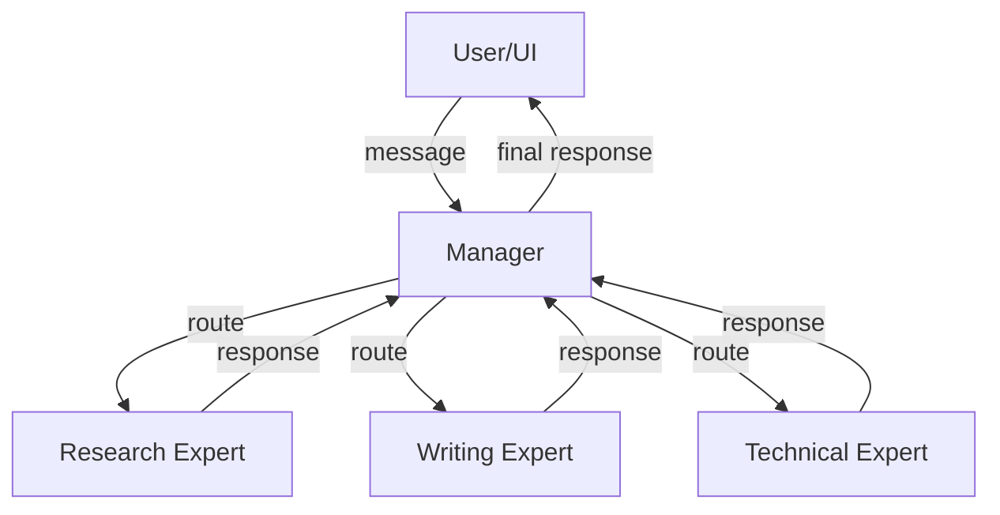
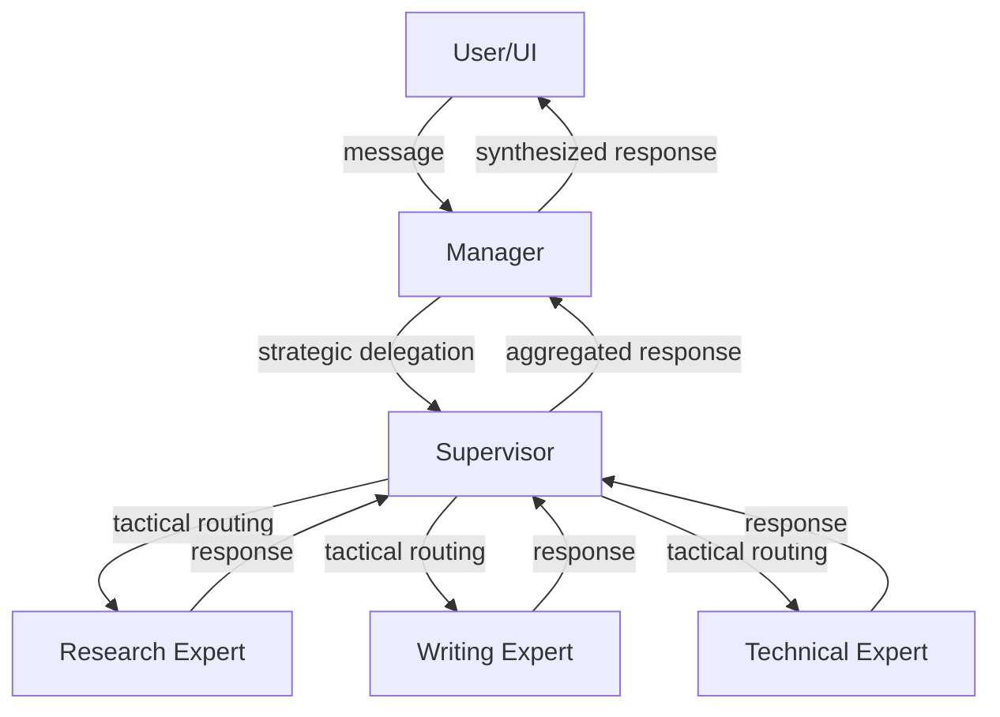
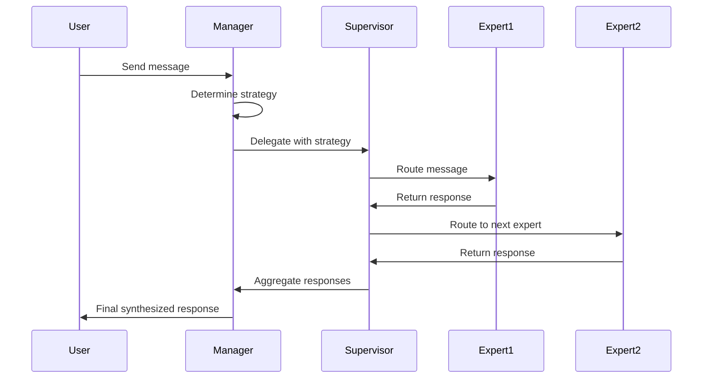

# Skill: Hymoex Architect

**Purpose:** Interactive guide to help developers and AI agents understand and apply Hymoex architectural patterns to build agentic systems.

**Key Principle:** Hymoex is a **cognitive architecture blueprint**, not a framework. It provides architectural patterns that can be applied to any technology stack or framework.

---

## What This Skill Does

This skill helps you:
1. **Understand** Hymoex architectural patterns (Manager, Supervisor, Expert, etc.)
2. **Map** your business problem to Hymoex components
3. **Choose** the right modality (One-Line MoE, Supervisor, MultiLine)
4. **Design** system architecture using Clean Code + SOLID principles
5. **Apply** Hymoex patterns to existing frameworks (LangGraph, CrewAI, etc.)
6. **Generate** technical guides, diagrams, and documentation

**What this is NOT:**
- ❌ A code generator for a specific language
- ❌ A rigid framework that you must adopt exactly
- ❌ A replacement for your existing tools

**What this IS:**
- ✅ An architectural thinking tool
- ✅ A pattern library adaptable to any language
- ✅ A guide to structure your agentic systems
- ✅ Compatible with any existing framework

---

## How to Use This Skill

### Basic Usage

```bash
# With a description of what you want to build
/hymoex-architect "I need a customer support system with technical and billing experts"

# Without description - interactive mode
/hymoex-architect
```

### What Happens Next

The skill will:
1. **Analyze** your requirements (or ask questions if needed)
2. **Present options** for architectural approaches
3. **Explain trade-offs** of each option
4. **Generate guides** adapted to your context
5. **Provide diagrams** to visualize the architecture
6. **Suggest next steps** for implementation

---

## Skill Workflow

### Phase 1: Context Analysis (Adaptive)

First, I'll understand your situation:

**Questions I might ask:**
- Do you have existing code or starting from scratch?
- If existing: What framework/stack are you using?
- How many expert domains do you need? (determines modality)
- Will this be distributed across teams? (determines topology)
- Do you need complex coordination? (determines Supervisor pattern)
- Are you migrating from another framework?

**Why these questions matter:**
- **Number of experts** → Suggests modality (MoE, Supervisor, MultiLine)
- **Distributed teams** → Suggests MultiLine pattern
- **Coordination complexity** → Suggests Supervisor pattern
- **Existing framework** → Tailors guidance to work with your tools

### Phase 2: Architectural Options (Flexible, not prescriptive)

Based on your context, I'll present **multiple options** with trade-offs:

**Example:**
```
Based on 3 expert domains, here are your options:

Option A: One-Line MoE Pattern
├─ Pros: Simple, direct, low overhead
├─ Cons: Limited coordination, harder to scale beyond 5 experts
└─ Best for: Straightforward delegation, independent experts

Option B: One-Line Supervisor Pattern
├─ Pros: Better coordination, easier to add experts later
├─ Cons: Slightly more complex, adds routing layer
└─ Best for: Expected growth, need for sequential workflows

Option C: Start simple, evolve later
├─ Pros: Fastest to implement, learn by doing
├─ Cons: May need refactoring if requirements change
└─ Best for: Prototyping, uncertain requirements

Which approach fits your needs? Or would you like a hybrid?
```

### Phase 3: Educational Guidance (Conceptual)

I'll explain the **why** behind recommendations using Hymoex concepts:

**Core Concepts Explained:**
- **Agent Pattern**: Autonomous component with role, capabilities, and communication
- **Manager Pattern**: Strategic coordinator (top-level decision making)
- **Supervisor Pattern**: Tactical coordinator (operational routing)
- **Expert Pattern**: Specialized agent for a specific domain
- **Message Protocol**: Structured communication between components

**Clean Architecture Principles:**
- **Single Responsibility**: Each component has one clear purpose
- **Open/Closed**: Easy to add new experts without changing existing code
- **Dependency Inversion**: High-level components don't depend on low-level details

### Phase 4: Technical Guides (Language-Agnostic)

I'll provide **pseudocode and technical specifications** that you can adapt to your language:

**What you'll get:**
- 📐 Conceptual interfaces (not language-specific code)
- 📊 Architecture diagrams (Mermaid format)
- 📋 Implementation checklists
- 🔄 Flow diagrams showing message passing
- 📚 References to detailed pattern documentation

**What you won't get:**
- ❌ Rigid Python/TypeScript/etc. code you must copy
- ❌ One "correct" implementation
- ❌ Framework-specific prescriptions

### Phase 5: Implementation Support (Adapted to your stack)

I'll help you apply patterns to your specific context:

**If you have existing code:**
- Analyze your current structure
- Suggest how to apply Hymoex patterns incrementally
- Show multiple refactoring paths
- Respect your existing architecture

**If starting fresh:**
- Provide starter templates in pseudocode
- Show multiple implementation approaches
- Guide you through architectural decisions
- Let you choose the style that fits

---

## Decision Guide: Choosing Your Architecture

### Quick Decision Matrix

| Your Situation | Suggested Modality | Reasoning |
|----------------|-------------------|-----------|
| 1-2 expert domains | One-Line MoE | Simplest pattern, direct delegation |
| 3-5 expert domains | One-Line Supervisor | Balance of simplicity and coordination |
| 6+ expert domains | MoE MultiLine | Scalable, supports team distribution |
| Need sequential workflows | Supervisor Pattern | Enables chaining and orchestration |
| Distributed teams | MultiLine Pattern | Supports independent team development |
| Unknown/prototyping | One-Line MoE | Start simple, evolve as needed |

**Note:** These are **suggestions**, not rules. Every system is unique.

### Detailed Decision Factors

#### Factor 1: Number of Expert Domains

```
1-2 Experts → One-Line MoE
├─ Manager directly coordinates experts
├─ Simple routing logic
└─ Minimal overhead

3-5 Experts → One-Line Supervisor
├─ Supervisor handles routing complexity
├─ Manager focuses on strategy
└─ Room to grow

6+ Experts → MoE MultiLine
├─ Organized into teams/groups
├─ Multiple Supervisors coordinate
└─ Scales horizontally
```

#### Factor 2: Coordination Complexity

```
Independent Tasks → MoE Pattern
├─ Experts work in parallel
├─ No inter-expert dependencies
└─ Simple aggregation of results

Sequential Workflows → Supervisor Pattern
├─ Tasks depend on previous outputs
├─ Need for conditional routing
└─ Complex orchestration logic

Mixed Workflows → Hybrid Pattern
├─ Some parallel, some sequential
├─ Multiple coordination strategies
└─ Flexible composition
```

#### Factor 3: Distribution Requirements

```
Single Team/Codebase → One-Line Pattern
├─ All code in one place
├─ Shared state management
└─ Simpler deployment

Multiple Teams → MultiLine Pattern
├─ Independent team codebases
├─ Distributed state
└─ Async communication
```

---

## Core Patterns Reference

### Pattern 1: Agent (Base Pattern)

**Concept:** Autonomous component with a role, capabilities, and communication interface.

**Responsibilities (SOLID - Single Responsibility):**
- Process incoming messages
- Execute domain-specific logic
- Return structured responses
- Maintain internal state (if needed)

**Conceptual Interface:**
```
Agent {
  properties:
    name: string
    role: string
    capabilities: list<string>

  methods:
    process(message: Message) -> Response
    can_handle(message: Message) -> boolean
}
```

**Implementation Guidance:**

1. **In Object-Oriented languages:**
   - Create Agent class/interface
   - Implement process() method
   - Subclass for specialized agents

2. **In Functional languages:**
   - Create agent record/struct
   - Define process function
   - Use higher-order functions for specialization

3. **In Procedural languages:**
   - Define agent struct
   - Create agent_process() function
   - Use function pointers for specialization

**Key Principles:**
- **Single Responsibility**: One domain, one agent
- **Encapsulation**: Internal logic hidden, clean interface exposed
- **Autonomy**: Can make decisions independently

---

### Pattern 2: Manager (Strategic Coordinator)

**Concept:** Top-level coordinator that determines overall strategy and delegates to specialists.

**Responsibilities (SOLID - Single Responsibility):**
- Receive requests from UI/API layer
- Analyze request to determine strategy
- Delegate to appropriate Supervisors or Experts
- Synthesize final response
- **Does NOT execute business logic** (Dependency Inversion)

**Conceptual Interface:**
```
Manager {
  properties:
    name: string
    experts: list<Agent>
    supervisors: list<Supervisor>
    strategy: Strategy

  methods:
    process(message: Message) -> Response
    determine_strategy(message: Message) -> Strategy
    delegate(message: Message, strategy: Strategy) -> list<Response>
    synthesize(responses: list<Response>) -> Response
}
```

**Implementation Guidance:**

1. **Determine Strategy Logic:**
   ```
   function determine_strategy(message):
     analyze message content/intent
     identify relevant experts/supervisors
     choose coordination pattern (parallel/sequential/MoE)
     return strategy object
   ```

2. **Delegation Logic:**
   ```
   function delegate(message, strategy):
     if strategy is "parallel":
       send message to all experts concurrently
       wait for all responses
     else if strategy is "sequential":
       send to first expert
       send output to next expert
       chain results
     else if strategy is "MoE":
       select best expert for message
       send only to that expert
     return collected responses
   ```

3. **Synthesis Logic:**
   ```
   function synthesize(responses):
     combine multiple responses
     resolve conflicts
     format final output
     return unified response
   ```

**Key Principles:**
- **Strategic, not tactical**: Decides "what" not "how"
- **Delegates, doesn't execute**: No domain logic
- **Coordinates, doesn't control**: Experts remain autonomous

**When to Use:**
- You need top-level orchestration
- Multiple experts/supervisors need coordination
- Strategic routing decisions required

---

### Pattern 3: Supervisor (Tactical Coordinator)

**Concept:** Mid-level coordinator that handles operational routing and orchestration within a domain or team.

**Responsibilities (SOLID - Single Responsibility):**
- Receive delegated tasks from Manager
- Route to appropriate Experts within team
- Implement coordination strategies (sequential, parallel, MoE)
- Aggregate results from Experts
- Return consolidated response

**Conceptual Interface:**
```
Supervisor {
  properties:
    name: string
    domain: string
    experts: list<Expert>
    routing_strategy: Strategy

  methods:
    process(message: Message) -> Response
    route(message: Message) -> list<Expert>
    coordinate(experts: list<Expert>, message: Message) -> list<Response>
    aggregate(responses: list<Response>) -> Response
}
```

**Coordination Strategies:**

1. **Mixture of Experts (MoE):**
   ```
   function coordinate_moe(experts, message):
     best_expert = select_best_expert(experts, message)
     response = best_expert.process(message)
     return response
   ```

2. **Sequential Execution:**
   ```
   function coordinate_sequential(experts, message):
     current_message = message
     responses = []
     for expert in experts:
       response = expert.process(current_message)
       responses.append(response)
       current_message = transform(response)  # output becomes next input
     return responses
   ```

3. **Parallel Execution:**
   ```
   function coordinate_parallel(experts, message):
     responses = []
     for expert in experts concurrently:
       response = expert.process(message)
       responses.append(response)
     return responses
   ```

**Implementation Guidance:**

1. **Choose coordination strategy based on:**
   - Task dependencies (sequential if outputs feed inputs)
   - Resource constraints (parallel if independent)
   - Optimization goals (MoE for efficiency)

2. **Routing logic:**
   ```
   function route(message):
     if message.requires_all_experts:
       return all experts
     else if message.has_clear_domain:
       return experts matching domain
     else:
       return select_best_expert(message)
   ```

3. **Aggregation logic:**
   ```
   function aggregate(responses):
     if single response:
       return response
     else if consensus needed:
       return vote(responses)
     else if synthesis needed:
       return combine(responses)
   ```

**Key Principles:**
- **Tactical, not strategic**: Handles "how" not "what"
- **Domain-focused**: Manages experts within a specific area
- **Flexible routing**: Adapts to message requirements

**When to Use:**
- You have 3+ experts in a domain
- Need complex routing logic
- Want to scale beyond simple MoE

---

### Pattern 4: Expert (Specialized Agent)

**Concept:** Domain specialist that executes specific tasks using tools and knowledge.

**Responsibilities (SOLID - Single Responsibility):**
- Handle messages within specific domain
- Execute tasks using tools
- Apply domain expertise
- Return domain-specific results
- **Single domain only** (Single Responsibility)

**Conceptual Interface:**
```
Expert extends Agent {
  properties:
    domain: string
    tools: list<Tool>
    knowledge_base: KnowledgeSource

  methods:
    can_handle(message: Message) -> boolean
    process(message: Message) -> Response
    use_tool(tool_name: string, params: dict) -> Result
}
```

**Implementation Guidance:**

1. **Domain Specialization:**
   ```
   Expert "ResearchExpert" {
     domain: "research"
     tools: [WebSearch, ReadDocs, SummarizeTool]

     can_handle(message):
       return message.intent in ["research", "find_info", "summarize"]

     process(message):
       search_results = use_tool("WebSearch", query=message.content)
       summary = use_tool("SummarizeTool", content=search_results)
       return Response(summary)
   }
   ```

2. **Tool Integration:**
   ```
   function use_tool(tool_name, params):
     tool = get_tool(tool_name)
     validate_params(tool, params)
     result = tool.execute(params)
     return result
   ```

3. **Knowledge Application:**
   ```
   function process(message):
     # Apply domain knowledge
     context = knowledge_base.retrieve(message.topic)

     # Use tools to execute
     results = []
     for step in execution_plan:
       result = use_tool(step.tool, step.params)
       results.append(result)

     # Synthesize domain-specific response
     return synthesize_expert_response(results, context)
   ```

**Key Principles:**
- **Single domain expertise**: Don't make "generalist" experts
- **Tool-equipped**: Experts need tools to execute
- **Autonomous decisions**: Can choose which tools to use
- **Stateless preferred**: Each message processed independently (if possible)

**When to Use:**
- You need specialized capabilities
- Domain requires specific tools
- Task complexity justifies dedicated agent

---

### Pattern 5: Message Protocol

**Concept:** Structured communication format for inter-agent messaging.

**Purpose:**
- Enable type-safe communication
- Carry metadata (sender, intent, priority)
- Support routing and filtering
- Facilitate debugging and logging

**Conceptual Interface:**
```
Message {
  properties:
    id: string (unique identifier)
    sender: string (agent name)
    recipient: string (agent name or "broadcast")
    intent: string (task type)
    content: any (message payload)
    metadata: dict (additional context)
    timestamp: datetime
    priority: integer (0-10)

  methods:
    to_dict() -> dict
    from_dict(dict) -> Message
    validate() -> boolean
}
```

**Implementation Guidance:**

1. **In strongly-typed languages:**
   - Define Message class/interface
   - Use type annotations for content
   - Validate types at compile time

2. **In dynamically-typed languages:**
   - Define Message schema
   - Validate at runtime
   - Use dictionaries/maps for flexibility

3. **In functional languages:**
   - Define Message record type
   - Use pattern matching on intent
   - Immutable by default

**Message Flow Pattern:**
```
User/UI
  ↓ [creates message]
Manager
  ↓ [routes message]
Supervisor (optional)
  ↓ [routes to expert]
Expert
  ↓ [processes and responds]
Supervisor (optional)
  ↓ [aggregates responses]
Manager
  ↓ [synthesizes final response]
User/UI
```

**Key Principles:**
- **Structured, not free-form**: Schema-defined
- **Self-describing**: Contains routing metadata
- **Traceable**: Unique ID for debugging
- **Extensible**: Metadata allows future additions

---

## Architectural Modalities

### Modality 1: One-Line MoE (Mixture of Experts)

**When to Use:**
- 1-2 expert domains
- Simple, direct delegation
- Independent tasks (no dependencies)
- Low coordination complexity

**Architecture:**
```
┌─────────┐
│ Manager │
└────┬────┘
     │ (selects best expert)
     │
     ├─────┬─────┬─────┐
     ↓     ↓     ↓     ↓
  Expert Expert Expert Expert
```

**How It Works:**
1. Manager receives message
2. Manager analyzes message to determine best expert
3. Manager sends message to selected expert
4. Expert processes and returns response
5. Manager returns response to user

**Pseudocode Structure:**
```
Manager {
  experts: [Expert1, Expert2, Expert3]

  process(message):
    best_expert = select_expert(message)
    response = best_expert.process(message)
    return response

  select_expert(message):
    for expert in experts:
      if expert.can_handle(message):
        return expert
    return default_expert
}
```

**Pros:**
- ✅ Simple architecture
- ✅ Low overhead
- ✅ Easy to understand
- ✅ Fast delegation

**Cons:**
- ❌ Limited to ~5 experts before complexity grows
- ❌ No sophisticated routing
- ❌ Harder to implement sequential workflows
- ❌ Manager handles all routing logic

**Best For:**
- MVPs and prototypes
- Simple use cases
- Independent expert tasks
- Getting started with Hymoex

---

### Modality 2: One-Line Supervisor

**When to Use:**
- 3-5 expert domains
- Need sequential or conditional workflows
- Expect to add more experts later
- Want separation between strategy and routing

**Architecture:**
```
┌─────────┐
│ Manager │ (strategic decisions)
└────┬────┘
     │
     ↓
┌────────────┐
│ Supervisor │ (tactical routing)
└──────┬─────┘
       │
       ├─────┬─────┬─────┐
       ↓     ↓     ↓     ↓
    Expert Expert Expert Expert
```

**How It Works:**
1. Manager receives message and determines strategy
2. Manager delegates to Supervisor
3. Supervisor routes to appropriate Expert(s) based on strategy
4. Supervisor aggregates Expert responses
5. Manager receives aggregated response and synthesizes final output

**Pseudocode Structure:**
```
Manager {
  supervisor: Supervisor

  process(message):
    strategy = determine_strategy(message)
    response = supervisor.process(message, strategy)
    return synthesize(response)
}

Supervisor {
  experts: [Expert1, Expert2, Expert3]

  process(message, strategy):
    if strategy is "sequential":
      return execute_sequential(message)
    else if strategy is "parallel":
      return execute_parallel(message)
    else if strategy is "moe":
      return execute_moe(message)

  execute_moe(message):
    best_expert = select_expert(message)
    return best_expert.process(message)

  execute_sequential(message):
    result = message
    for expert in experts:
      result = expert.process(result)
    return result

  execute_parallel(message):
    responses = []
    for expert in experts concurrently:
      responses.append(expert.process(message))
    return aggregate(responses)
}
```

**Pros:**
- ✅ Better separation of concerns (Manager vs Supervisor)
- ✅ Supports multiple coordination strategies
- ✅ Easier to add experts without changing Manager
- ✅ Scales better than One-Line MoE

**Cons:**
- ❌ Additional layer of coordination
- ❌ Slightly more complex
- ❌ Still limited to single codebase

**Best For:**
- Production systems with known complexity
- Need for workflow orchestration
- Expected growth in expert count
- Teams wanting clean architecture

---

### Modality 3: MoE MultiLine

**When to Use:**
- 6+ expert domains
- Multiple teams developing independently
- Distributed systems
- Different experts in different codebases/languages

**Architecture:**
```
┌─────────────┐
│  Integrator │ (strategic synthesis)
└──────┬──────┘
       │
       ├────────────────┬────────────────┐
       ↓                ↓                ↓
┌──────────────┐ ┌──────────────┐ ┌──────────────┐
│ExpertManager1│ │ExpertManager2│ │ExpertManager3│
└──────┬───────┘ └──────┬───────┘ └──────┬───────┘
       │                │                │
   ┌───┴───┐        ┌───┴───┐        ┌───┴───┐
   ↓       ↓        ↓       ↓        ↓       ↓
Expert  Expert   Expert  Expert   Expert  Expert
(Team1) (Team1)  (Team2) (Team2)  (Team3) (Team3)
```

**Components:**

1. **Integrator**: Top-level coordinator (like Manager but for distributed systems)
2. **Expert Managers**: Mid-level coordinators for each team/domain
3. **Experts**: Specialized agents within each team

**How It Works:**
1. Integrator receives message
2. Integrator determines which Expert Managers to involve
3. Each Expert Manager coordinates its local experts
4. Expert Managers return responses to Integrator
5. Integrator synthesizes final response

**Pseudocode Structure:**
```
Integrator {
  expert_managers: [EM1, EM2, EM3]

  process(message):
    strategy = determine_strategy(message)
    relevant_managers = select_managers(message, strategy)

    responses = []
    for manager in relevant_managers:
      response = manager.process(message)
      responses.append(response)

    return synthesize(responses)
}

ExpertManager {
  supervisor: Supervisor
  experts: [Expert1, Expert2, Expert3]

  process(message):
    # Local coordination strategy
    routing_strategy = determine_local_strategy(message)
    response = supervisor.process(message, routing_strategy)
    return response
}
```

**Pros:**
- ✅ Scales to many experts (10+, 50+, etc.)
- ✅ Supports distributed teams
- ✅ Independent development and deployment
- ✅ Language/framework agnostic (each team can use different stack)
- ✅ Clear organizational boundaries

**Cons:**
- ❌ Most complex architecture
- ❌ Requires distributed coordination
- ❌ Network communication overhead
- ❌ Harder to debug
- ❌ Needs robust error handling

**Best For:**
- Large organizations with multiple teams
- Microservices architecture
- Cross-language systems
- Scaling to many domains

---

## Implementation Checklists

### Checklist 1: One-Line MoE Implementation

- [ ] **Define Message Protocol**
  - [ ] Message structure/schema
  - [ ] Routing metadata (sender, recipient, intent)
  - [ ] Validation logic

- [ ] **Create Base Agent Interface**
  - [ ] process(message) method
  - [ ] can_handle(message) method
  - [ ] Response structure

- [ ] **Implement Experts**
  - [ ] One Expert per domain
  - [ ] Each Expert has clear responsibilities
  - [ ] Tool integration for each Expert

- [ ] **Implement Manager**
  - [ ] Expert selection logic
  - [ ] Message routing
  - [ ] Response handling

- [ ] **Test Communication Flow**
  - [ ] Message creation
  - [ ] Routing to correct Expert
  - [ ] Response propagation

### Checklist 2: One-Line Supervisor Implementation

- [ ] **Everything from One-Line MoE checklist**

- [ ] **Implement Supervisor**
  - [ ] MoE strategy
  - [ ] Sequential strategy
  - [ ] Parallel strategy
  - [ ] Aggregation logic

- [ ] **Separate Manager Responsibilities**
  - [ ] Strategic decision making
  - [ ] Delegation to Supervisor
  - [ ] Final synthesis

- [ ] **Test Coordination Strategies**
  - [ ] MoE selection works correctly
  - [ ] Sequential execution chains properly
  - [ ] Parallel execution completes all tasks

### Checklist 3: MoE MultiLine Implementation

- [ ] **Everything from One-Line Supervisor checklist**

- [ ] **Implement Integrator**
  - [ ] Expert Manager selection
  - [ ] Distributed coordination
  - [ ] Cross-team synthesis

- [ ] **Implement Expert Managers**
  - [ ] One per team/domain
  - [ ] Local Supervisor integration
  - [ ] Team-specific routing

- [ ] **Setup Communication Infrastructure**
  - [ ] Message queue/broker (if async)
  - [ ] API layer (if sync)
  - [ ] Error handling for network failures

- [ ] **Test Distributed Flow**
  - [ ] Cross-team communication
  - [ ] Failure handling
  - [ ] Performance under load

---

## Generating Diagrams

I can generate Mermaid diagrams to visualize your architecture:

### Diagram Types

1. **Architecture Diagram**: Shows components and their relationships
2. **Sequence Diagram**: Shows message flow over time
3. **Component Diagram**: Shows detailed component structure

### Example: One-Line MoE



### Example: One-Line Supervisor



### Example: Sequence Diagram



---

## Framework Integration Guides

Hymoex can work **alongside** existing frameworks:

### Supported Frameworks

1. **LangGraph** - See `framework-mappings/langgraph-mapping.md`
2. **CrewAI** - See `framework-mappings/crewai-mapping.md`
3. **AutoGen** - See `framework-mappings/autogen-mapping.md`
4. **OpenAI Swarm** - See `framework-mappings/openai-swarm-mapping.md`
5. **Mastra** - See `framework-mappings/mastra-mapping.md`
6. **Pydantic AI** - See `framework-mappings/pydantic-ai-mapping.md` (Recommended)

### Integration Philosophy

**Hymoex is not a replacement - it's an architectural lens.**

You can:
- Keep using your existing framework
- Apply Hymoex patterns to organize your code
- Think in Hymoex terms while implementing in framework terms
- Gradually adopt more Hymoex patterns over time

**Example:**
```
Your LangGraph code remains LangGraph.
But you organize it using:
- StateGraph = Manager pattern
- Nodes = Expert pattern
- Edges = Message protocol

You get: LangGraph execution + Hymoex organization
```

---

## Interactive Questions

When you invoke this skill, I may ask these questions to understand your needs:

### Category 1: Context Discovery

1. **"Do you have existing code or are you starting fresh?"**
   - Why: Determines if we adapt or design from scratch

2. **"What framework/language are you using?"**
   - Why: Tailors guidance to your stack

3. **"What problem are you trying to solve?"**
   - Why: Helps map to Hymoex components

### Category 2: Architecture Requirements

4. **"How many distinct expert domains do you need?"**
   - Why: Determines modality (MoE vs Supervisor vs MultiLine)

5. **"Do experts work independently or need coordination?"**
   - Why: Determines if Supervisor pattern is needed

6. **"Will this be distributed across teams/services?"**
   - Why: Determines if MultiLine pattern is needed

### Category 3: Implementation Preferences

7. **"Do you prefer OOP, functional, or procedural style?"**
   - Why: Adapts pseudocode examples to your style

8. **"What level of complexity are you comfortable with?"**
   - Why: Chooses between simple and sophisticated approaches

9. **"Do you want to start simple and evolve, or build complete upfront?"**
   - Why: Determines incremental vs comprehensive approach

---

## Sample Interactions

### Interaction 1: Simple Customer Support System

**User Input:**
```
/hymoex-architect "Build a customer support system with technical and billing experts"
```

**Skill Response:**

```
📐 Analyzing Requirements...

Based on your description:
- 2 expert domains (technical, billing)
- Likely independent tasks
- Simple routing needs

🎯 Recommended Architecture: One-Line MoE

Here's why:
✅ Only 2 experts - MoE pattern is sufficient
✅ Likely independent tasks - no complex coordination needed
✅ Simple and fast to implement
✅ Easy to understand and maintain

📊 Architecture Diagram:

┌──────────────┐
│   Manager    │ (Routes to best expert)
└──────┬───────┘
       │
       ├─────────────┬─────────────┐
       ↓             ↓             ↓
┌────────────┐ ┌────────────┐ ┌─────────┐
│ Technical  │ │  Billing   │ │ General │
│   Expert   │ │   Expert   │ │ Expert  │
└────────────┘ └────────────┘ └─────────┘

🔍 Component Breakdown:

Manager:
- Analyzes customer message
- Determines if technical or billing issue
- Routes to appropriate expert
- Returns expert's response

Technical Expert:
- Handles: technical issues, bugs, integrations
- Tools: documentation search, code analysis
- Returns: technical solutions

Billing Expert:
- Handles: invoices, payments, subscriptions
- Tools: billing system API, transaction lookup
- Returns: billing information and solutions

📝 Implementation Guide:

[Would generate pseudocode/technical specs here]

Would you like me to:
1. Generate detailed pseudocode for this architecture?
2. Show how to implement this in a specific framework (LangGraph, CrewAI, etc.)?
3. Provide a migration path from existing code?
4. Explore alternative architectures?
```

---

### Interaction 2: Complex Research System

**User Input:**
```
/hymoex-architect "I need a research system with 8 experts across 3 teams:
- Team A: Web research, academic papers, patents (3 experts)
- Team B: Data analysis, visualization, statistics (3 experts)
- Team C: Writing, editing, citation formatting (2 experts)"
```

**Skill Response:**

```
📐 Analyzing Requirements...

Based on your description:
- 8 expert domains across 3 teams
- Distributed team structure
- Clear organizational boundaries

🎯 Recommended Architecture: MoE MultiLine

Here's why:
✅ 8 experts - beyond optimal range for single-line patterns
✅ 3 distinct teams - natural boundary for Expert Managers
✅ Distributed structure - each team can develop independently
✅ Scalable - easy to add more experts to each team

📊 Architecture Diagram:

┌─────────────────┐
│   Integrator    │ (Strategic synthesis)
└────────┬────────┘
         │
    ┌────┴────┬────────────┬─────────┐
    ↓         ↓            ↓
┌────────┐ ┌───────┐ ┌──────────┐
│  EM-A  │ │ EM-B  │ │   EM-C   │
│Research│ │ Data  │ │ Writing  │
└───┬────┘ └───┬───┘ └────┬─────┘
    │          │           │
    ├──┬──┬    ├──┬──┬     ├──┬
    ↓  ↓  ↓    ↓  ↓  ↓     ↓  ↓
   E1 E2 E3   E4 E5 E6    E7 E8

EM = Expert Manager
E = Expert

🔍 Component Breakdown:

Integrator:
- Receives research request
- Determines which teams needed (A, B, C or subset)
- Coordinates cross-team synthesis
- Returns final research report

Expert Manager A (Research):
- Coordinates: Web researcher, Academic researcher, Patent researcher
- Strategy: Parallel execution (all research concurrently)
- Returns: Aggregated research findings

Expert Manager B (Data):
- Coordinates: Data analyst, Visualization expert, Statistics expert
- Strategy: Sequential (analyze → visualize → validate)
- Returns: Analyzed and visualized data

Expert Manager C (Writing):
- Coordinates: Writer, Editor
- Strategy: Sequential (write → edit)
- Returns: Polished written output

📝 Alternative Approaches:

Option A: Start with One-Line Supervisor, evolve to MultiLine
├─ Pros: Simpler initial implementation
├─ Cons: Will need refactoring as teams grow
└─ Best for: Uncertain requirements, rapid prototyping

Option B: Full MultiLine from start (Recommended)
├─ Pros: Scales naturally, clean team boundaries
├─ Cons: More upfront complexity
└─ Best for: Known complexity, multiple teams

Option C: Hybrid - Single-line with team namespaces
├─ Pros: Middle ground complexity
├─ Cons: Harder to distribute teams later
└─ Best for: Single codebase, logical team separation

🤔 Which approach fits your team structure and timeline?

Would you like me to:
1. Generate detailed specs for MultiLine architecture?
2. Show deployment strategy for distributed teams?
3. Provide migration path from simpler architecture?
4. Create team-specific implementation guides?
```

---

### Interaction 3: Migrating from LangGraph

**User Input:**
```
/hymoex-architect "I have a LangGraph system with 4 nodes. How can I apply Hymoex patterns?"
```

**Skill Response:**

```
📐 Analyzing Your Situation...

You have existing LangGraph code → Let's apply Hymoex patterns without breaking your system.

🎯 Philosophy: Hymoex OVER LangGraph (not replacing it)

Hymoex provides **architectural thinking** that works with LangGraph:
- StateGraph → Manager pattern (conceptual mapping)
- Nodes → Expert pattern (conceptual mapping)
- Edges → Message protocol (conceptual mapping)

📊 Current State Analysis:

Your LangGraph system (4 nodes) maps to:
- StateGraph = Your Manager equivalent
- 4 Nodes = Your 4 Experts
- Edges = Your message routing

🔍 Three Paths Forward:

Path 1: Keep LangGraph, Think Hymoex (Recommended for you)
━━━━━━━━━━━━━━━━━━━━━━━━━━━━━━━━━━━━━━━━
Approach:
- Keep your LangGraph code exactly as-is
- Apply Hymoex conceptual patterns to organize thinking
- Use Hymoex principles for future nodes

Benefits:
✅ Zero code changes needed
✅ Immediate conceptual clarity
✅ Easy to explain architecture to team
✅ Guides future development

Example:
```python
# Your existing LangGraph code stays the same
graph = StateGraph()
graph.add_node("researcher", research_node)
graph.add_node("analyzer", analyze_node)

# But you document/think about it in Hymoex terms:
# - StateGraph = Manager (orchestration)
# - "researcher" node = Research Expert
# - "analyzer" node = Analysis Expert
# - Edges = Message flow between experts
```

Path 2: Gradual Hymoex Integration
━━━━━━━━━━━━━━━━━━━━━━━━━━━━━━━
Approach:
- Restructure node functions using Hymoex patterns
- Keep LangGraph for execution
- Organize code with Manager/Expert mental model

Benefits:
✅ Better code organization
✅ Still uses LangGraph execution
✅ Easier to add new nodes
✅ Cleaner separation of concerns

Example:
```python
# Restructure with Hymoex patterns
class ResearchExpert:
    def process(self, message):
        # Hymoex Expert pattern
        return research_result

class AnalysisExpert:
    def process(self, message):
        # Hymoex Expert pattern
        return analysis_result

# LangGraph nodes call Hymoex-structured experts
def research_node(state):
    expert = ResearchExpert()
    return expert.process(state)

graph.add_node("researcher", research_node)
```

Path 3: Full Hymoex Implementation
━━━━━━━━━━━━━━━━━━━━━━━━━━━━━━
Approach:
- Rebuild with pure Hymoex patterns
- Replace LangGraph with custom orchestration
- Maximum architectural control

Benefits:
✅ Full Hymoex architecture
✅ No framework constraints
✅ Complete customization

Trade-offs:
❌ Requires rewrite
❌ Lose LangGraph features
❌ More maintenance

🤔 For your situation (existing LangGraph + 4 nodes):

I recommend **Path 1** because:
- Your current system works
- 4 nodes is manageable in LangGraph
- You get Hymoex benefits without refactoring
- Can evolve to Path 2 later if needed

📚 Next Steps:

1. Read the LangGraph mapping guide: `framework-mappings/langgraph-mapping.md`
2. Document your nodes using Hymoex terminology
3. Apply Hymoex principles to future nodes
4. Consider Path 2 when adding more complexity

Would you like me to:
1. Show detailed mapping of your 4 nodes to Hymoex patterns?
2. Generate Hymoex-style documentation for your LangGraph code?
3. Provide refactoring guide for Path 2?
4. Show how to add new nodes using Hymoex thinking?
```

---

## Validation and Testing

### Architecture Validation Checklist

After designing your architecture, verify:

- [ ] **Clear Responsibilities**
  - [ ] Each component has single responsibility
  - [ ] No overlapping duties between components
  - [ ] Boundaries are well-defined

- [ ] **Message Flow**
  - [ ] Messages have clear sender and recipient
  - [ ] Routing logic is deterministic
  - [ ] No circular dependencies

- [ ] **Scalability**
  - [ ] Can add new experts without major refactoring
  - [ ] Architecture supports expected growth
  - [ ] Performance acceptable under load

- [ ] **Error Handling**
  - [ ] Each component handles errors gracefully
  - [ ] Failed operations don't crash system
  - [ ] Errors propagate with context

- [ ] **Testing Strategy**
  - [ ] Each expert can be tested independently
  - [ ] Integration tests cover message flow
  - [ ] End-to-end tests validate full system

### Suggested Tests

```
Test 1: Expert Independence
├─ Create mock message
├─ Send to each expert independently
├─ Verify expert processes correctly
└─ Verify no dependencies on other experts

Test 2: Routing Logic
├─ Create messages for each domain
├─ Verify Manager/Supervisor routes correctly
├─ Verify no messages lost or duplicated
└─ Verify correct expert receives message

Test 3: Coordination Strategies
├─ Test MoE selection
├─ Test sequential execution order
├─ Test parallel execution completion
└─ Verify aggregation logic

Test 4: Error Recovery
├─ Simulate expert failure
├─ Verify system continues operating
├─ Verify error propagates correctly
└─ Verify graceful degradation

Test 5: End-to-End Flow
├─ Send complex message requiring multiple experts
├─ Verify full execution path
├─ Verify final response quality
└─ Measure performance metrics
```

---

## Common Pitfalls and Solutions

### Pitfall 1: Too Many Experts in One-Line MoE

**Problem:** Adding 10+ experts to a Manager leads to complex routing logic.

**Solution:** Migrate to Supervisor pattern or MultiLine.

**How:**
```
Before (complex):
Manager → routes to 10 experts directly

After (clean):
Manager → Supervisor → routes within team of 5 experts
         → Supervisor → routes within team of 5 experts
```

### Pitfall 2: Experts Doing Manager's Job

**Problem:** Experts making strategic decisions instead of domain-specific work.

**Solution:** Move strategic logic to Manager, keep experts focused on domain.

**How:**
```
❌ Bad:
Expert.process(message):
  if message.needs_other_expert:
    call_other_expert()  # Expert making routing decision

✅ Good:
Expert.process(message):
  return domain_specific_result  # Expert stays in domain

Manager.process(message):
  if needs_multiple_experts:
    coordinate_experts()  # Manager makes routing decision
```

### Pitfall 3: Tight Coupling Between Experts

**Problem:** Expert A directly calls Expert B, creating dependencies.

**Solution:** All inter-expert communication goes through Manager/Supervisor.

**How:**
```
❌ Bad:
ExpertA.process(message):
  result = ExpertB.process(message)  # Direct coupling

✅ Good:
ExpertA.process(message):
  return partial_result

Manager.process(message):
  result_a = ExpertA.process(message)
  result_b = ExpertB.process(result_a)  # Manager orchestrates
```

### Pitfall 4: Stateful Experts

**Problem:** Experts maintain state between messages, causing race conditions.

**Solution:** Keep experts stateless; state lives in Manager or external store.

**How:**
```
❌ Bad:
class Expert:
  def __init__(self):
    self.history = []  # Stateful

  def process(self, message):
    self.history.append(message)  # Accumulating state

✅ Good:
class Expert:
  def process(self, message, context):
    # Receives context, doesn't store it
    return result

Manager maintains state:
class Manager:
  def __init__(self):
    self.conversation_history = []  # State here
```

### Pitfall 5: Generic Experts

**Problem:** Creating "GeneralistExpert" that does everything.

**Solution:** Split into specialized experts with clear domains.

**How:**
```
❌ Bad:
class GeneralistExpert:
  def process(self, message):
    if message.type == "research":
      do_research()
    elif message.type == "writing":
      do_writing()
    elif message.type == "analysis":
      do_analysis()
    # Expert knows too much!

✅ Good:
class ResearchExpert:
  def process(self, message):
    return do_research()

class WritingExpert:
  def process(self, message):
    return do_writing()

# Each expert has single responsibility
```

---

## Extending This Skill

This skill is designed to be extended. You can:

### Add New Patterns

Create new pattern files in `patterns/` directory:
- `patterns/custom-coordination.md`
- `patterns/advanced-routing.md`
- `patterns/observability.md`

### Add New Framework Mappings

Create new mapping files in `framework-mappings/`:
- `framework-mappings/llamaindex-mapping.md`
- `framework-mappings/haystack-mapping.md`
- `framework-mappings/semantic-kernel-mapping.md`

### Add New Examples

Create new example files in `examples/`:
- `examples/e-commerce-system.md`
- `examples/healthcare-assistant.md`
- `examples/financial-advisor.md`

### Customize Decision Logic

Edit `decision-guide.md` to add:
- New decision factors
- Custom heuristics
- Domain-specific guidance

---

## Getting Help

If you need clarification or have questions during architecture design:

1. **Ask about concepts:** "Explain the difference between Manager and Supervisor"
2. **Request alternatives:** "Show me other ways to structure this"
3. **Seek trade-offs:** "What are pros/cons of MultiLine vs Supervisor?"
4. **Get examples:** "Show an example of sequential coordination"

I'm here to guide, not prescribe. Your architecture should fit YOUR needs.

---

## References

- `core-concepts.md` - Fundamental Hymoex concepts
- `decision-guide.md` - Detailed decision-making framework
- `patterns/` - Implementation pattern library
- `examples/` - Example architectures
- `framework-mappings/` - Integration with existing frameworks
- `reference/` - Quick reference documentation

---

## Skill Metadata

**Version:** 1.0.0
**Last Updated:** 2026-02-12
**Compatibility:** All LLMs, all programming languages
**License:** Same as Hymoex project
